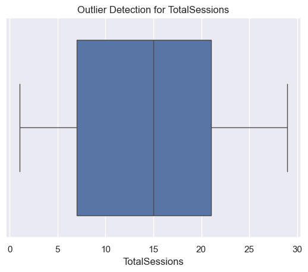
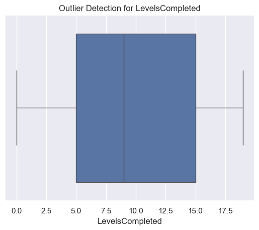
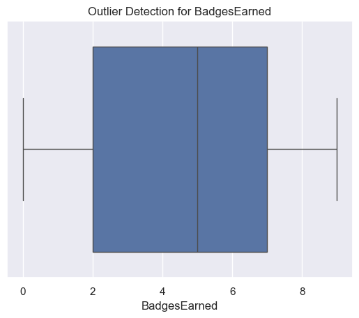
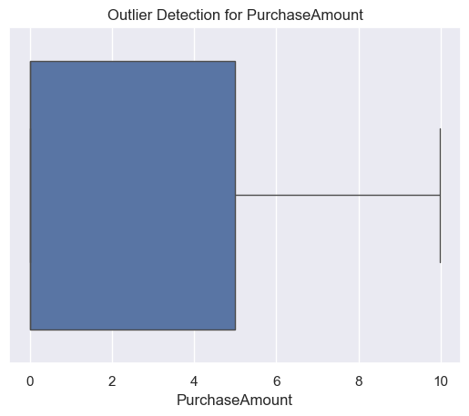
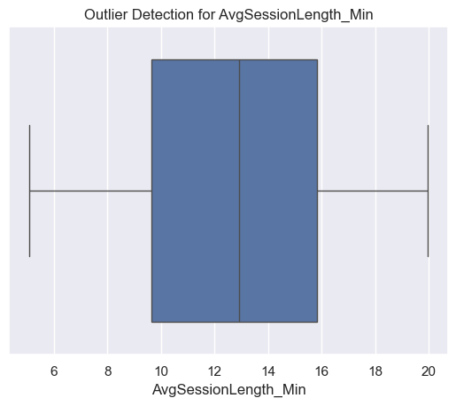
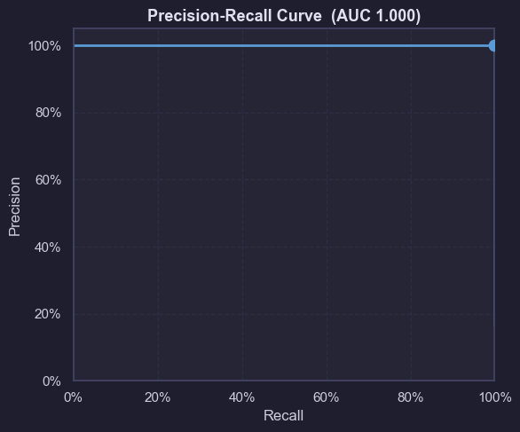
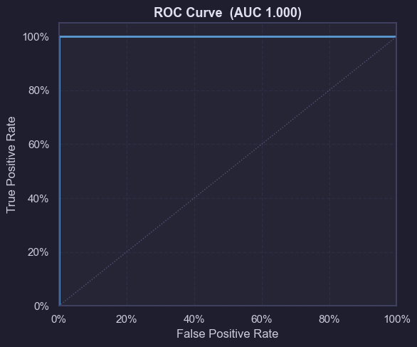
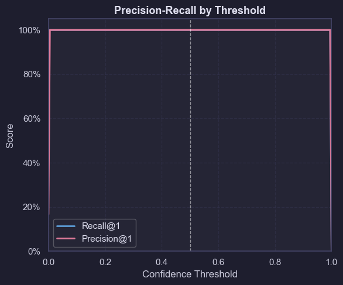
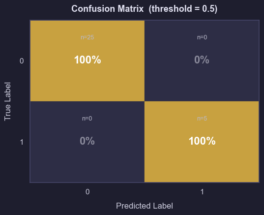
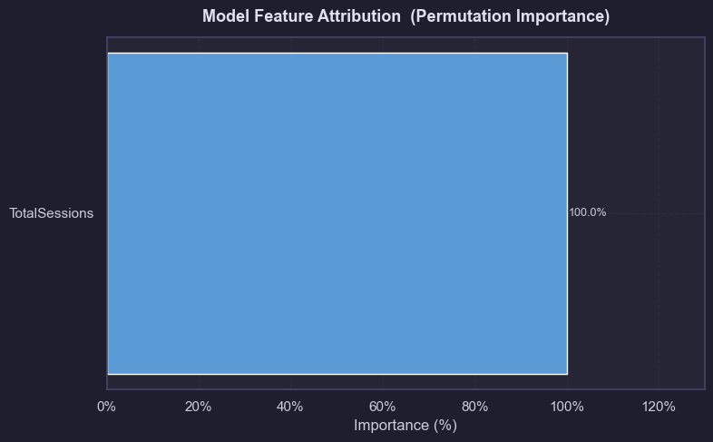

```python
import pandas as pd
import numpy as np
from scipy import stats
from scipy.stats import ttest_ind
from statsmodels.stats.proportion import proportions_ztest
import statsmodels.api as sm
import matplotlib.pyplot as plt
import plotly.express as px
import seaborn as sns

sns.set(color_codes=True) 

import warnings
warnings.filterwarnings('ignore')
```


```python
file = r"C:\Users\TUGCE\Desktop\data_analytics\synthetic_userdata_app.csv"
df = pd.read_csv(file, encoding="utf-8")
print(df.shape)
```

    (150, 10)
    


```python
df.head(10)
```


<div>
<style scoped>
    .dataframe tbody tr th:only-of-type {
        vertical-align: middle;
    }

    .dataframe tbody tr th {
        vertical-align: top;
    }

    .dataframe thead th {
        text-align: right;
    }
</style>
<table border="1" class="dataframe">
  <thead>
    <tr style="text-align: right;">
      <th></th>
      <th>UID</th>
      <th>AcquisitionSource</th>
      <th>Platform</th>
      <th>TotalSessions</th>
      <th>LevelsCompleted</th>
      <th>BadgesEarned</th>
      <th>PurchaseAmount</th>
      <th>AvgSessionLength_Min</th>
      <th>RecentSessionDate</th>
      <th>ChurnRisk</th>
    </tr>
  </thead>
  <tbody>
    <tr>
      <th>0</th>
      <td>2001</td>
      <td>OrganicLanding</td>
      <td>Android</td>
      <td>13</td>
      <td>0</td>
      <td>6</td>
      <td>0.00</td>
      <td>16.82</td>
      <td>2025-10-09</td>
      <td>0</td>
    </tr>
    <tr>
      <th>1</th>
      <td>2002</td>
      <td>GoogleAds</td>
      <td>iOS</td>
      <td>9</td>
      <td>7</td>
      <td>8</td>
      <td>0.00</td>
      <td>11.45</td>
      <td>2025-08-22</td>
      <td>0</td>
    </tr>
    <tr>
      <th>2</th>
      <td>2003</td>
      <td>OrganicLanding</td>
      <td>iOS</td>
      <td>22</td>
      <td>13</td>
      <td>8</td>
      <td>4.99</td>
      <td>6.87</td>
      <td>2025-08-08</td>
      <td>0</td>
    </tr>
    <tr>
      <th>3</th>
      <td>2004</td>
      <td>OrganicLanding</td>
      <td>iOS</td>
      <td>24</td>
      <td>1</td>
      <td>5</td>
      <td>0.00</td>
      <td>8.65</td>
      <td>2025-09-21</td>
      <td>0</td>
    </tr>
    <tr>
      <th>4</th>
      <td>2005</td>
      <td>MetaAds</td>
      <td>Android</td>
      <td>24</td>
      <td>16</td>
      <td>6</td>
      <td>4.99</td>
      <td>6.83</td>
      <td>2025-10-22</td>
      <td>0</td>
    </tr>
    <tr>
      <th>5</th>
      <td>2006</td>
      <td>OrganicLanding</td>
      <td>iOS</td>
      <td>15</td>
      <td>1</td>
      <td>5</td>
      <td>0.00</td>
      <td>18.25</td>
      <td>2025-10-01</td>
      <td>0</td>
    </tr>
    <tr>
      <th>6</th>
      <td>2007</td>
      <td>OrganicLanding</td>
      <td>iOS</td>
      <td>15</td>
      <td>7</td>
      <td>6</td>
      <td>0.00</td>
      <td>13.32</td>
      <td>2025-08-25</td>
      <td>0</td>
    </tr>
    <tr>
      <th>7</th>
      <td>2008</td>
      <td>GoogleAds</td>
      <td>iOS</td>
      <td>24</td>
      <td>5</td>
      <td>0</td>
      <td>0.00</td>
      <td>13.29</td>
      <td>2025-10-10</td>
      <td>0</td>
    </tr>
    <tr>
      <th>8</th>
      <td>2009</td>
      <td>OrganicLanding</td>
      <td>Android</td>
      <td>29</td>
      <td>19</td>
      <td>4</td>
      <td>4.99</td>
      <td>10.70</td>
      <td>2025-10-09</td>
      <td>0</td>
    </tr>
    <tr>
      <th>9</th>
      <td>2010</td>
      <td>GoogleAds</td>
      <td>iOS</td>
      <td>22</td>
      <td>16</td>
      <td>9</td>
      <td>4.99</td>
      <td>5.44</td>
      <td>2025-10-06</td>
      <td>0</td>
    </tr>
  </tbody>
</table>
</div>


```python
df.columns
```


    Index(['UID', 'AcquisitionSource', 'Platform', 'TotalSessions',
           'LevelsCompleted', 'BadgesEarned', 'PurchaseAmount',
           'AvgSessionLength_Min', 'RecentSessionDate', 'ChurnRisk'],
          dtype='object')


```python
df.dtypes
```


    UID                       int64
    AcquisitionSource        object
    Platform                 object
    TotalSessions             int64
    LevelsCompleted           int64
    BadgesEarned              int64
    PurchaseAmount          float64
    AvgSessionLength_Min    float64
    RecentSessionDate        object
    ChurnRisk                 int64
    dtype: object


```python
df.isnull().sum()
```


    UID                     0
    AcquisitionSource       0
    Platform                0
    TotalSessions           0
    LevelsCompleted         0
    BadgesEarned            0
    PurchaseAmount          0
    AvgSessionLength_Min    0
    RecentSessionDate       0
    ChurnRisk               0
    dtype: int64


```python
df.isna().sum()
```


    UID                     0
    AcquisitionSource       0
    Platform                0
    TotalSessions           0
    LevelsCompleted         0
    BadgesEarned            0
    PurchaseAmount          0
    AvgSessionLength_Min    0
    RecentSessionDate       0
    ChurnRisk               0
    dtype: int64


```python
df.duplicated
```


    <bound method DataFrame.duplicated of       UID AcquisitionSource Platform  TotalSessions  LevelsCompleted  \
    0    2001    OrganicLanding  Android             13                0   
    1    2002         GoogleAds      iOS              9                7   
    2    2003    OrganicLanding      iOS             22               13   
    3    2004    OrganicLanding      iOS             24                1   
    4    2005           MetaAds  Android             24               16   
    ..    ...               ...      ...            ...              ...   
    145  2146           MetaAds  Android             16               18   
    146  2147           MetaAds  Android             22               19   
    147  2148    OrganicLanding  Android             28                2   
    148  2149    OrganicLanding  Android             21                8   
    149  2150         GoogleAds  Android              7                0   
    
         BadgesEarned  PurchaseAmount  AvgSessionLength_Min RecentSessionDate  \
    0               6            0.00                 16.82        2025-10-09   
    1               8            0.00                 11.45        2025-08-22   
    2               8            4.99                  6.87        2025-08-08   
    3               5            0.00                  8.65        2025-09-21   
    4               6            4.99                  6.83        2025-10-22   
    ..            ...             ...                   ...               ...   
    145             9            0.00                 10.67        2025-10-11   
    146             6            4.99                 12.80        2025-08-13   
    147             7            4.99                 16.87        2025-10-13   
    148             7            4.99                  5.57        2025-08-10   
    149             6            0.00                 12.92        2025-09-15   
    
         ChurnRisk  
    0            0  
    1            0  
    2            0  
    3            0  
    4            0  
    ..         ...  
    145          0  
    146          0  
    147          0  
    148          0  
    149          0  
    
    [150 rows x 10 columns]>


```python
df["ChurnRisk"].unique()
```


    array([0, 1])


```python
df["AcquisitionSource"].unique()
```


    array(['OrganicLanding', 'GoogleAds', 'MetaAds'], dtype=object)


```python
df["Platform"].unique()
```


    array(['Android', 'iOS'], dtype=object)


```python
df["TotalSessions"].value_counts()
```


    TotalSessions
    15    13
    22     9
    18     9
    1      9
    27     8
    17     7
    20     7
    8      7
    24     7
    7      7
    16     6
    6      6
    3      6
    14     5
    2      5
    4      5
    28     4
    11     4
    21     4
    9      3
    29     3
    10     3
    26     3
    13     2
    5      2
    19     2
    23     2
    12     1
    25     1
    Name: count, dtype: int64


```python
#CheckOutliers

numerical_cols = [
    'TotalSessions',
    'LevelsCompleted',
    'BadgesEarned',
    'PurchaseAmount',
    'AvgSessionLength_Min'
]

for col in numerical_cols:
    plt.figure()
    sns.boxplot(x=df[col])
    plt.title(f'Outlier Detection for {col}')
    plt.show()

```


    

    


    

    


    

    


    

    


    

    


```python
def detect_outliers(df, col):
    Q1 = df[col].quantile(0.25)
    Q3 = df[col].quantile(0.75)
    IQR = Q3 - Q1

    lower = Q1 - 1.5 * IQR
    upper = Q3 + 1.5 * IQR

    return df[(df[col] < lower) | (df[col] > upper)]

for col in numerical_cols:
    outliers = detect_outliers(df, col)
    print(f"{col}: {len(outliers)} outliers")
```

    TotalSessions: 0 outliers
    LevelsCompleted: 0 outliers
    BadgesEarned: 0 outliers
    PurchaseAmount: 0 outliers
    AvgSessionLength_Min: 0 outliers
    


```python
import matplotlib.ticker as mticker
import warnings
warnings.filterwarnings('ignore')

from sklearn.model_selection import train_test_split
from sklearn.ensemble import GradientBoostingClassifier
from sklearn.preprocessing import LabelEncoder
from sklearn.metrics import (
    roc_curve, auc,
    precision_recall_curve, average_precision_score,
    confusion_matrix, roc_auc_score,
    f1_score, precision_score, recall_score, log_loss
)

# Dark theme matching Vertex AI
plt.rcParams.update({
    'figure.facecolor': '#1e1e2e',
    'axes.facecolor':   '#252535',
    'axes.edgecolor':   '#444466',
    'axes.labelcolor':  '#ccccdd',
    'xtick.color':      '#ccccdd',
    'ytick.color':      '#ccccdd',
    'text.color':       '#e0e0f0',
    'grid.color':       '#33334d',
    'grid.linestyle':   '--',
    'grid.alpha':        0.6,
    'font.size':         11,
    'axes.titlesize':    13,
    'axes.titleweight': 'bold',
})

BLUE = '#5b9bd5'
PINK = '#e07b9a'
print("Libraries loaded ✓")
```

    Libraries loaded ✓
    


```python
df['RecentSessionDate'] = pd.to_datetime(df['RecentSessionDate'])
ref_date = df['RecentSessionDate'].max()
df['DaysSinceSession'] = (ref_date - df['RecentSessionDate']).dt.days

for col in ['AcquisitionSource', 'Platform']:
    df[col] = LabelEncoder().fit_transform(df[col])

feature_cols = [
    'TotalSessions', 'PurchaseAmount', 'AvgSessionLength_Min',
    'AcquisitionSource', 'BadgesEarned', 'Platform',
    'UID', 'LevelsCompleted', 'DaysSinceSession'
]

X = df[feature_cols]
y = df['ChurnRisk'].astype(int)

X_train, X_test, y_train, y_test = train_test_split(
    X, y, test_size=0.2, random_state=42, stratify=y
)

print(f"Train: {X_train.shape}, Test: {X_test.shape}")
```

    Train: (120, 9), Test: (30, 9)
    


```python
model = GradientBoostingClassifier(
    n_estimators=200, max_depth=4, learning_rate=0.1, random_state=42
)
model.fit(X_train, y_train)

y_proba = model.predict_proba(X_test)[:, 1]
y_pred  = (y_proba >= 0.5).astype(int)

print(f"ROC AUC : {roc_auc_score(y_test, y_proba):.3f}")
print(f"PR  AUC : {average_precision_score(y_test, y_proba):.3f}")
```

    ROC AUC : 1.000
    PR  AUC : 1.000
    


```python
prec, rec, pr_thresh = precision_recall_curve(y_test, y_proba)
pr_auc_val = average_precision_score(y_test, y_proba)

fig, ax = plt.subplots(figsize=(6, 5))

ax.plot(rec, prec, color=BLUE, lw=2)

# Dot at threshold = 0.5
idx = np.argmin(np.abs(pr_thresh - 0.5))
ax.scatter([rec[idx]], [prec[idx]], color=BLUE, s=80, zorder=5)

ax.set_xlim(0, 1)
ax.set_ylim(0, 1.05)
ax.xaxis.set_major_formatter(mticker.PercentFormatter(1.0))
ax.yaxis.set_major_formatter(mticker.PercentFormatter(1.0))
ax.set_xlabel('Recall')
ax.set_ylabel('Precision')
ax.set_title(f'Precision-Recall Curve  (AUC {pr_auc_val:.3f})')
ax.grid(True)

plt.tight_layout()
plt.savefig('precision_recall_curve.png', dpi=150, bbox_inches='tight',
            facecolor=fig.get_facecolor())
plt.show()
```


    

    


```python
fpr, tpr, _ = roc_curve(y_test, y_proba)
roc_auc_val = auc(fpr, tpr)

fig, ax = plt.subplots(figsize=(6, 5))

ax.plot(fpr, tpr, color=BLUE, lw=2)
ax.plot([0, 1], [0, 1], color='#555577', lw=1, linestyle=':')  # random baseline

ax.set_xlim(0, 1)
ax.set_ylim(0, 1.05)
ax.xaxis.set_major_formatter(mticker.PercentFormatter(1.0))
ax.yaxis.set_major_formatter(mticker.PercentFormatter(1.0))
ax.set_xlabel('False Positive Rate')
ax.set_ylabel('True Positive Rate')
ax.set_title(f'ROC Curve  (AUC {roc_auc_val:.3f})')
ax.grid(True)

plt.tight_layout()
plt.savefig('roc_curve.png', dpi=150, bbox_inches='tight',
            facecolor=fig.get_facecolor())
plt.show()
```


    

    


```python
thresholds_plot = np.linspace(0, 1, 200)
prec_at_t, rec_at_t = [], []

for t in thresholds_plot:
    pred_t = (y_proba >= t).astype(int)
    tp = ((pred_t == 1) & (y_test == 1)).sum()
    fp = ((pred_t == 1) & (y_test == 0)).sum()
    fn = ((pred_t == 0) & (y_test == 1)).sum()
    prec_at_t.append(tp / (tp + fp + 1e-9))
    rec_at_t.append(tp  / (tp + fn + 1e-9))

fig, ax = plt.subplots(figsize=(6, 5))

ax.plot(thresholds_plot, rec_at_t,  color=BLUE, lw=2, label='Recall@1')
ax.plot(thresholds_plot, prec_at_t, color=PINK, lw=2, label='Precision@1')
ax.axvline(0.5, color='white', lw=1, linestyle='--', alpha=0.5)

ax.set_xlim(0, 1)
ax.set_ylim(0, 1.05)
ax.yaxis.set_major_formatter(mticker.PercentFormatter(1.0))
ax.set_xlabel('Confidence Threshold')
ax.set_ylabel('Score')
ax.set_title('Precision-Recall by Threshold')
ax.legend(loc='lower left', framealpha=0.3)
ax.grid(True)

plt.tight_layout()
plt.savefig('precision_recall_by_threshold.png', dpi=150, bbox_inches='tight',
            facecolor=fig.get_facecolor())
plt.show()
```


    

    


```python
cm = confusion_matrix(y_test, y_pred)
cm_pct = cm.astype(float) / cm.sum(axis=1, keepdims=True) * 100

fig, ax = plt.subplots(figsize=(5.5, 4.5))
fig.patch.set_facecolor('#1e1e2e')
ax.set_facecolor('#252535')

for i in range(2):
    for j in range(2):
        val   = cm_pct[i, j]
        color = '#c8a140' if i == j else '#2d2d45'
        ax.add_patch(plt.Rectangle([j - 0.5, i - 0.5], 1, 1, color=color))
        ax.text(j, i, f'{val:.0f}%',
                ha='center', va='center', fontsize=16, fontweight='bold',
                color='white' if i == j else '#888899')
        ax.text(j, i - 0.28, f'n={cm[i, j]}',
                ha='center', va='center', fontsize=9, color='#bbbbcc')

ax.set_xlim(-0.5, 1.5)
ax.set_ylim(-0.5, 1.5)
ax.set_xticks([0, 1]); ax.set_xticklabels(['0', '1'])
ax.set_yticks([0, 1]); ax.set_yticklabels(['0', '1'])
ax.set_xlabel('Predicted Label', labelpad=10)
ax.set_ylabel('True Label',      labelpad=10)
ax.set_title('Confusion Matrix  (threshold = 0.5)', pad=12)
ax.invert_yaxis()

plt.tight_layout()
plt.savefig('confusion_matrix.png', dpi=150, bbox_inches='tight',
            facecolor=fig.get_facecolor())
plt.show()
```


    

    


```python
from sklearn.inspection import permutation_importance

result = permutation_importance(model, X_test, y_test, n_repeats=30, random_state=42)

feat_df = pd.DataFrame({
    'Feature':    X.columns,
    'Importance': result.importances_mean
})
feat_df = feat_df[feat_df['Importance'] > 0]  # drop negatives
total   = feat_df['Importance'].sum()
feat_df['Importance'] = (feat_df['Importance'] / total) * 100
feat_df = feat_df.sort_values('Importance', ascending=True)

fig, ax = plt.subplots(figsize=(8, 5))
bars = ax.barh(feat_df['Feature'], feat_df['Importance'],
               color=BLUE, height=0.55)

ax.set_xlabel('Importance (%)')
ax.set_title('Model Feature Attribution  (Permutation Importance)', pad=12)
ax.xaxis.set_major_formatter(mticker.PercentFormatter())
ax.set_xlim(0, feat_df['Importance'].max() * 1.3)
ax.grid(axis='x', alpha=0.5)

for bar, val in zip(bars, feat_df['Importance']):
    ax.text(val + 0.3, bar.get_y() + bar.get_height() / 2,
            f'{val:.1f}%', va='center', fontsize=9, color='#ccccdd')

plt.tight_layout()
plt.savefig('feature_importance.png', dpi=150, bbox_inches='tight',
            facecolor=fig.get_facecolor())
plt.show()
```


    

    


```python
metrics = {
    'PR AUC':                  round(average_precision_score(y_test, y_proba), 3),
    'ROC AUC':                 round(roc_auc_score(y_test, y_proba), 3),
    'Log loss':                round(log_loss(y_test, y_proba), 3),
    'Micro-average F1':        round(f1_score(y_test, y_pred, average='micro'), 7),
    'Macro-average F1':        round(f1_score(y_test, y_pred, average='macro'), 7),
    'Micro-average precision': f"{precision_score(y_test, y_pred, average='micro') * 100:.1f}%",
    'Micro-average recall':    f"{recall_score(y_test, y_pred,  average='micro') * 100:.1f}%",
}

pd.DataFrame.from_dict(metrics, orient='index', columns=['Value'])
```


<div>
<style scoped>
    .dataframe tbody tr th:only-of-type {
        vertical-align: middle;
    }

    .dataframe tbody tr th {
        vertical-align: top;
    }

    .dataframe thead th {
        text-align: right;
    }
</style>
<table border="1" class="dataframe">
  <thead>
    <tr style="text-align: right;">
      <th></th>
      <th>Value</th>
    </tr>
  </thead>
  <tbody>
    <tr>
      <th>PR AUC</th>
      <td>1.0</td>
    </tr>
    <tr>
      <th>ROC AUC</th>
      <td>1.0</td>
    </tr>
    <tr>
      <th>Log loss</th>
      <td>0.0</td>
    </tr>
    <tr>
      <th>Micro-average F1</th>
      <td>1.0</td>
    </tr>
    <tr>
      <th>Macro-average F1</th>
      <td>1.0</td>
    </tr>
    <tr>
      <th>Micro-average precision</th>
      <td>100.0%</td>
    </tr>
    <tr>
      <th>Micro-average recall</th>
      <td>100.0%</td>
    </tr>
  </tbody>
</table>
</div>


```python

```
